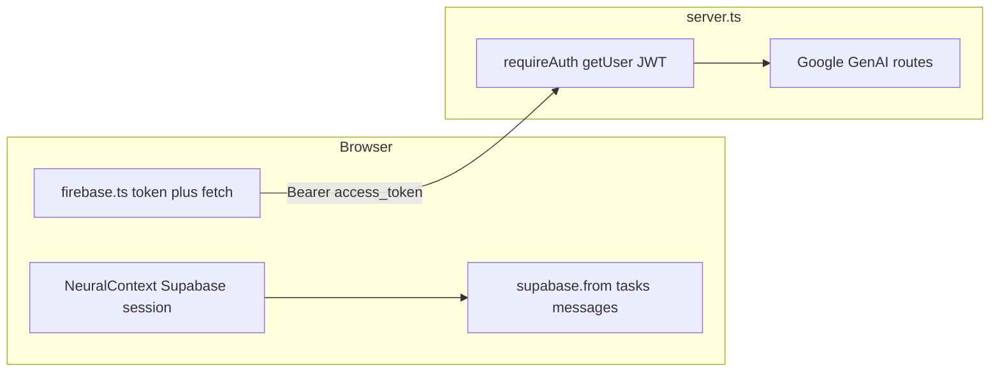

# Deep read-only inspection (Firebase / Supabase / server / UI)

**Verified fact:** There is **no** `firebase` or `firebase-admin` dependency in [package.json](package.json). There is **no** `src/firestore.ts`, `Robot3D` component file, or `initializeApp` / `getFirestore` / `onSnapshot` usage under [src/](src/).

**Verified fact:** [src/firebase.ts](src/firebase.ts) is a **misnamed module**: it imports [src/lib/supabase.ts](src/lib/supabase.ts), implements OAuth sign-in/out with `supabase.auth`, exposes `auth.currentUser` from the Supabase session, and sends **`Authorization: Bearer <supabase access_token>`** via `getProtectedIdToken` / `fetchProtectedJson`—not a Firebase ID token.

**Stale documentation (assumption vs code):** [docs/CURRENT_FIREBASE_DEPENDENCY_MAP.md](docs/CURRENT_FIREBASE_DEPENDENCY_MAP.md) still describes Firebase init, Firestore, and `firebase-admin` in [server.ts](server.ts); that **does not match** the current tree. Treat that doc as **migration-era dead weight** unless refreshed.

---

## 1. Verified Firebase dependency map by file

| Location | What actually runs (verified) |
|-----------|-------------------------------|
| [src/firebase.ts](src/firebase.ts) | Supabase session mirror (`currentUser`), OAuth, `getProtectedIdToken` (access token), `fetchProtectedJson`, `handleFirestoreError` (name legacy; logic uses Supabase `User`) |
| [src/App.tsx](src/App.tsx) | Imports `loginWithGoogle`, `logout` from `./firebase` (Supabase OAuth under the hood) |
| [src/components/ChatInterface.tsx](src/components/ChatInterface.tsx) | Imports `auth`, `fetchProtectedJson`, `getClientSafeMessage`, `handleFirestoreError` from `../firebase`; data CRUD via `supabase.from('messages')` |
| [src/components/TaskLog.tsx](src/components/TaskLog.tsx) | Imports `handleFirestoreError` from `../firebase`; data CRUD via `supabase.from('tasks')` |
| [src/context/NeuralContext.tsx](src/context/NeuralContext.tsx) | `User` from `@supabase/supabase-js`; `getSession` + `onAuthStateChange` on [src/lib/supabase.ts](src/lib/supabase.ts) client |
| [server.ts](server.ts) | `createClient` + `supabaseAdmin.auth.getUser(token)` for Bearer verification—**no** Firebase Admin |
| [templates/](templates/) | Example/snippet files (e.g. `NeuralContext.auth-snippet.tsx`, `supabase.ts`)—**not** wired into the app build; safe to treat as reference or remove after cutover cleanup |

**No verified Firebase runtime dependency** in active application code paths traced above.

---

## 2. Exact Supabase replacement target for each “Firebase” touchpoint

| Current artifact | Replacement / current reality |
|------------------|-------------------------------|
| `src/firebase.ts` module name and `handleFirestoreError` / `OperationType` | Rename/re-scope to something like `authGateway.ts` / `dataAccessErrors.ts`; keep `fetchProtectedJson` + token helper as the **canonical AI proxy auth path** |
| `auth` object in `firebase.ts` | Already **Supabase session user**; optional dedupe with [NeuralContext.tsx](src/context/NeuralContext.tsx) (two sources of truth: context state vs module-level `currentUser`) |
| `getProtectedIdToken` | Already **Supabase `session.access_token`**—align naming/comments with “Supabase JWT” for server parity |
| Task/message persistence | Already **Postgres via Supabase client**—no Firestore target |
| Server token verification | Already **`supabaseAdmin.auth.getUser`**—no `verifyIdToken` target |

---

## 3. Schema: Firestore assumptions vs desired Postgres schema

**Verified alignment:** [supabase/sql/001_schema.sql](supabase/sql/001_schema.sql) defines `public.tasks` and `public.messages` with columns that match how [TaskLog.tsx](src/components/TaskLog.tsx) and [ChatInterface.tsx](src/components/ChatInterface.tsx) read/write (`user_id` uuid, snake_case in DB, mapped to camelCase in UI for tasks).

**Assumption to validate in deployment (not visible in TS alone):** RLS in [supabase/sql/002_rls.sql](supabase/sql/002_rls.sql) must be applied in the Supabase project; otherwise clients will see permission errors with **different** message text than Firestore’s `"Missing or insufficient permissions"`.

**Verified mismatch (error UX):** [src/firebase.ts](src/firebase.ts) `handleFirestoreError` still branches on Firestore-specific copy for permission failures. PostgREST/RLS failures will typically surface as different `Error` messages—**behavioral assumption**, not yet aligned in code.

---

## 4. Auth behavior tied to Firebase user object shape

**Verified:** [NeuralContext.tsx](src/context/NeuralContext.tsx) uses **`User` from `@supabase/supabase-js`**.

**Verified:** [src/firebase.ts](src/firebase.ts) `DataAccessErrorInfo` / `handleFirestoreError` maps `user?.id`, `email`, `email_confirmed_at`, `is_anonymous`, `identities[]`—these are **Supabase user fields**, not Firebase `User` fields (naming in types like `providerId` still reads Firebase-ish but data comes from Supabase `identities`).

---

## 5. Code that assumes Firestore realtime semantics

**Verified:** There is **no** `onSnapshot` or Firestore listener in `src/`.

**Verified:** `TaskLog` and `ChatInterface` load data in `useEffect` when `userId` changes—**request/response only**. No `supabase.channel` realtime subscription found in `src/`.

**Implication:** Multi-tab live sync or “push” updates from DB **do not exist** today; any future “Firestore-like” UX would be a **new** Supabase Realtime feature, not a preservation of current behavior.

---

## 6. Server code depending on Firebase Admin token verification

**Verified:** **None.** [server.ts](server.ts) `requireAuth` uses `supabaseAdmin.auth.getUser(token)` after `Bearer ` parse (lines 32–56 in the read slice).

**Verified call path for AI:** `app.use('/api/ai/', requireAuth)` applies to subsequent `/api/ai/*` route registrations, including `GET /api/ai/video-status/:id` (see [server.ts](server.ts) ~468–588)—so **video status polling is also JWT-protected** the same as `POST` chat/image/video.

---

## 7. Likely migration risk to UI behavior

- **Low:** Auth gating in panels (`user?.id`) already matches Supabase user ids.
- **Low–medium:** Duplicate auth state: `NeuralContext` `user` vs `firebase.ts` `auth.currentUser` (e.g. [ChatInterface.tsx](src/components/ChatInterface.tsx) checks both `userId` and `auth.currentUser` before submit)—edge cases if they diverge briefly during refresh.
- **Medium (operational):** Misleading errors if RLS or schema drift: `handleFirestoreError` may not classify Supabase errors as cleanly as old Firestore strings.
- **Low:** No realtime today, so **no regression** from removing Firestore listeners (there are none).

---

## 8. Final migration risk score (0–10)

**Score: 2 / 10**

Rationale: **Data and auth paths are already on Supabase** in production code; remaining risk is **hygiene and operations** (RLS deployed, env `VITE_SUPABASE_*` / `SUPABASE_SERVICE_ROLE_KEY`, stale docs, legacy naming causing future mistakes), not a full datastore rewrite.

---

## Architecture snapshot (verified)

---

## Dead code / post-cutover candidates (verified labels, not an edit list)

- [docs/CURRENT_FIREBASE_DEPENDENCY_MAP.md](docs/CURRENT_FIREBASE_DEPENDENCY_MAP.md): **stale** vs repo.
- [templates/](templates/): **non-runtime** snippets; optional delete or move to internal docs.
- Naming in [src/firebase.ts](src/firebase.ts): **semantic dead weight** (`handleFirestoreError`, `OperationType` paths like `tasks/123` are logical labels only).

**Hard rule honored:** No code was written during this inspection; facts above are from static reads and ripgrep-style searches.

---

## Multi-folder comparison (read-only, retry pass)

**Path note (verified):** There is **no** directory whose name is exactly `N.E.O-the-N.E.R.D` under `Desktop\NERD_PROJECTS` in the scan used for this pass. Related trees on disk:

- [NERD_PROJECTS/N.E.O.-the-N.E.R.D](file:///C:/Users/Aztr0nutZs/Desktop/NERD_PROJECTS/N.E.O.-the-N.E.R.D) — workspace / “original” inspection target
- [Desktop/N.E.O.-the-N.E.R.D](file:///C:/Users/Aztr0nutZs/Desktop/N.E.O.-the-N.E.R.D) — second full Supabase copy (Capacitor-aware OAuth in `firebase.ts`)
- [Desktop/N.E.O.-the-N.E.R.D-supa](file:///C:/Users/Aztr0nutZs/Desktop/N.E.O.-the-N.E.R.D-supa) — Supabase + `@capacitor/browser` native OAuth (`Browser.open`)
- [Desktop/N.E.O_the_N.E.R.D](file:///C:/Users/Aztr0nutZs/Desktop/N.E.O_the_N.E.R.D) — **legacy Firebase + Firestore + firebase-admin** stack (underscore spelling; closest “alternate spelling” variant)

**Trees compared first (primary diff)**

- **Original / NERD layout:** [NERD_PROJECTS/N.E.O.-the-N.E.R.D](file:///C:/Users/Aztr0nutZs/Desktop/NERD_PROJECTS/N.E.O.-the-N.E.R.D)
- **Recently added / Desktop layout:** [Desktop/N.E.O.-the-N.E.R.D](file:///C:/Users/Aztr0nutZs/Desktop/N.E.O.-the-N.E.R.D) (same project name segment `N.E.O.-the-N.E.R.D`; different parent folder)

### High-signal diffs (verified)

| Area | NERD_PROJECTS copy | Desktop copy |
|------|--------------------|--------------|
| [package.json](file:///C:/Users/Aztr0nutZs/Desktop/NERD_PROJECTS/N.E.O.-the-N.E.R.D/package.json) | No `@capacitor/app` | Adds `@capacitor/app` (^8.1.0) |
| [src/firebase.ts](file:///C:/Users/Aztr0nutZs/Desktop/N.E.O.-the-N.E.R.D/src/firebase.ts) | Web OAuth: `signInWithOAuth` with `redirectTo: window.location.origin` | Capacitor-aware OAuth: `skipBrowserRedirect`, native callback `com.ai.assistant://auth/callback`, `initializeAuthRedirectHandling`, URL/hash cleanup, `consumeAuthRedirectError`, consent path helpers |
| [src/App.tsx](file:///C:/Users/Aztr0nutZs/Desktop/N.E.O.-the-N.E.R.D/src/App.tsx) | Imports only `loginWithGoogle`, `logout` from `./firebase` | Also wires `initializeAuthRedirectHandling`, `isOAuthConsentPath`, `normalizeOAuthConsentPath`, `consumeAuthRedirectError`, `getClientSafeMessage` (native + web redirect UX) |
| [server.ts](file:///C:/Users/Aztr0nutZs/Desktop/N.E.O.-the-N.E.R.D/server.ts) (sampled) | `requireAuth` + Supabase admin `getUser` | Same pattern (no Firebase Admin in either) |
| Data layer (`tasks` / `messages`) | `supabase.from(...)` in TaskLog / ChatInterface | Same table usage (grep parity) |
| [supabase/sql](file:///C:/Users/Aztr0nutZs/Desktop/N.E.O.-the-N.E.R.D/supabase/sql) | 001/002/003 present | Same three files present |
| [docs/CURRENT_FIREBASE_DEPENDENCY_MAP.md](file:///C:/Users/Aztr0nutZs/Desktop/N.E.O.-the-N.E.R.D/docs/CURRENT_FIREBASE_DEPENDENCY_MAP.md) | Stale Firebase-era narrative | Same stale file (identical opening) |
| [android/capacitor.settings.gradle](file:///C:/Users/Aztr0nutZs/Desktop/NERD_PROJECTS/N.E.O.-the-N.E.R.D/android/capacitor.settings.gradle) | Only `:capacitor-android` included | Also includes `:capacitor-app` → `node_modules/@capacitor/app/android` |

### Retry verification (second read-only pass)

- Re-grep on **NERD_PROJECTS** `src/` for `initializeAuthRedirectHandling`, `skipBrowserRedirect`, and `com.ai.assistant`: **no matches in application TypeScript** (those strings appear under `android/` and `capacitor.config.ts`, not in the slim `firebase.ts`).
- Re-read both **android/capacitor.settings.gradle** files: **NERD_PROJECTS** does not wire the Capacitor App plugin at the Gradle level; **Desktop** does. This matches `package.json` (`@capacitor/app` only on Desktop).
- **Implication (assumption):** Both copies ship `com.ai.assistant` / URL scheme resources in Android, but **only the Desktop tree** currently pairs that with **runtime** `@capacitor/app` listeners + PKCE-style return handling in `src/firebase.ts`. Native Google OAuth reliability may **differ by tree** even though neither uses Firebase.

### Same conclusions for both trees (verified)

- No `firebase` / `firebase-admin` npm deps; no `onSnapshot` / `getFirestore` / `initializeApp` in `src/`.
- `src/firebase.ts` remains a **Supabase auth + HTTP helper** with legacy naming; `handleFirestoreError` still uses Firestore-flavored permission string check in **both** copies.
- AI proxy auth: Bearer **Supabase access token**; server verifies via **`supabaseAdmin.auth.getUser`** in both.

### Desktop-only migration / ops notes (assumptions)

- **Supabase Dashboard:** must allow redirect URLs for web (`/oauth/consent` origin) and native (`com.ai.assistant://auth/callback`) if Android/iOS builds use this copy.
- **Slightly higher behavioral surface** than NERD copy: deep links, `sessionStorage` error keys, and `exchangeCodeForSession`—more to test, but still **no Firestore**.

### Revised risk scores (0–10) for the inspection checklist

- **NERD_PROJECTS copy:** **2 / 10** (hygiene + stale doc; native OAuth story thinner than Android URL scheme suggests—align or document).
- **Desktop copy:** **3 / 10** (same datastore/server story; +1 for OAuth/native redirect complexity and config coupling—not Firebase risk).

---

### Third tree: `N.E.O.-the-N.E.R.D-supa` (verified)

| Area | vs NERD_PROJECTS |
|------|------------------|
| [package.json](file:///C:/Users/Aztr0nutZs/Desktop/N.E.O.-the-N.E.R.D-supa/package.json) | Adds `@capacitor/app`, `@capacitor/browser` (no `@capacitor/app`-only parity with Desktop’s web redirect surface—uses **in-app browser** for OAuth URL) |
| [src/firebase.ts](file:///C:/Users/Aztr0nutZs/Desktop/N.E.O.-the-N.E.R.D-supa/src/firebase.ts) | Supabase-only; `loginWithGoogle` uses `Browser.open({ url })` on native; `skipBrowserRedirect: Capacitor.isNativePlatform()` |
| [src/context/NeuralContext.tsx](file:///C:/Users/Aztr0nutZs/Desktop/N.E.O.-the-N.E.R.D-supa/src/context/NeuralContext.tsx) | Adds `authError` / `setAuthError`; calls `initializeMobileAuth` + `getClientSafeMessage` from `../firebase` (mobile session / deep-link handling—**still not Firebase SDK**) |
| [server.ts](file:///C:/Users/Aztr0nutZs/Desktop/N.E.O.-the-N.E.R.D-supa/server.ts) | Same Supabase `requireAuth` + `getUser` as other Supabase trees |
| Firebase / Firestore in `src/` | **None** (grep hits are legacy names + `node_modules` noise) |

**Risk score:** **3 / 10** (same as Desktop: extra native OAuth moving parts; zero Firestore runtime).

---

### Fourth tree: `N.E.O_the_N.E.R.D` — **Firebase baseline** (verified)

| Area | Finding |
|------|---------|
| [package.json](file:///C:/Users/Aztr0nutZs/Desktop/N.E.O_the_N.E.R.D/package.json) | **`firebase`**, **`firebase-admin`**, **`three`**, **`@react-three/fiber`**, **`@react-three/drei`** — **no** `@supabase/supabase-js` |
| [src/firebase.ts](file:///C:/Users/Aztr0nutZs/Desktop/N.E.O_the_N.E.R.D/src/firebase.ts) | `initializeApp`, `getAuth`, `getFirestore`, `firebase-applet-config.json` |
| [src/components/TaskLog.tsx](file:///C:/Users/Aztr0nutZs/Desktop/N.E.O_the_N.E.R.D/src/components/TaskLog.tsx) | **`onSnapshot`**, `setDoc` / `updateDoc` / `deleteDoc` — **Firestore realtime** |
| [src/components/ChatInterface.tsx](file:///C:/Users/Aztr0nutZs/Desktop/N.E.O_the_N.E.R.D/src/components/ChatInterface.tsx) | **`onSnapshot`**, `getDocs`, Firestore writes |
| [src/context/NeuralContext.tsx](file:///C:/Users/Aztr0nutZs/Desktop/N.E.O_the_N.E.R.D/src/context/NeuralContext.tsx) | `onAuthStateChanged`, `User` from **`firebase/auth`** |
| [server.ts](file:///C:/Users/Aztr0nutZs/Desktop/N.E.O_the_N.E.R.D/server.ts) | **`firebase-admin`** + **`admin.auth().verifyIdToken(token)`** for AI routes |
| UI label | [App.tsx](file:///C:/Users/Aztr0nutZs/Desktop/N.E.O_the_N.E.R.D/src/App.tsx) uses **“Firebase Sync”** diagnostic copy (Supabase trees use “Supabase Sync” or equivalent elsewhere) |

**Risk score (Firestore → Supabase migration if this tree were the target):** **8 / 10** — full client + server Firebase coupling, realtime listeners, and 3D stack dependencies; not comparable to the “already migrated” NERD/Desktop trees except at UI shell level.

---

### Cross-tree summary (MASTER_INSPECTION outputs 1–8, condensed)

1. **Dependency map:** NERD + Desktop + supa = **Supabase-only runtime** + legacy filename `firebase.ts`. Underscore tree = **real Firebase + Firestore + Admin**.
2. **Supabase replacement:** **Done** in three trees; **underscore tree is the pre-migration reference implementation**.
3. **Schema:** NERD/Desktop/supa align with [supabase/sql](file:///C:/Users/Aztr0nutZs/Desktop/NERD_PROJECTS/N.E.O.-the-N.E.R.D/supabase/sql) **when using Postgres**; underscore tree uses **Firestore paths** (`users/{uid}/tasks`, etc.—grep-verified in prior doc style).
4. **Auth user shape:** Supabase trees → `@supabase/supabase-js` `User`. Underscore tree → `firebase/auth` `User`.
5. **Realtime:** **Only** underscore tree uses **`onSnapshot`**; Supabase trees use **one-shot** loads + local state.
6. **Server token verification:** Supabase trees → **`getUser`**. Underscore → **`verifyIdToken`**.
7. **UI risk:** Merging **supa** or **Desktop** into **NERD** is mostly **OAuth + NeuralContext surface** (error state, redirect handlers); merging underscore tree would be a **full migration** with realtime semantics change.
8. **Scores:** NERD **2**; Desktop **3**; supa **3**; underscore **8** (as migration source), **0** if the goal is only to archive it.
