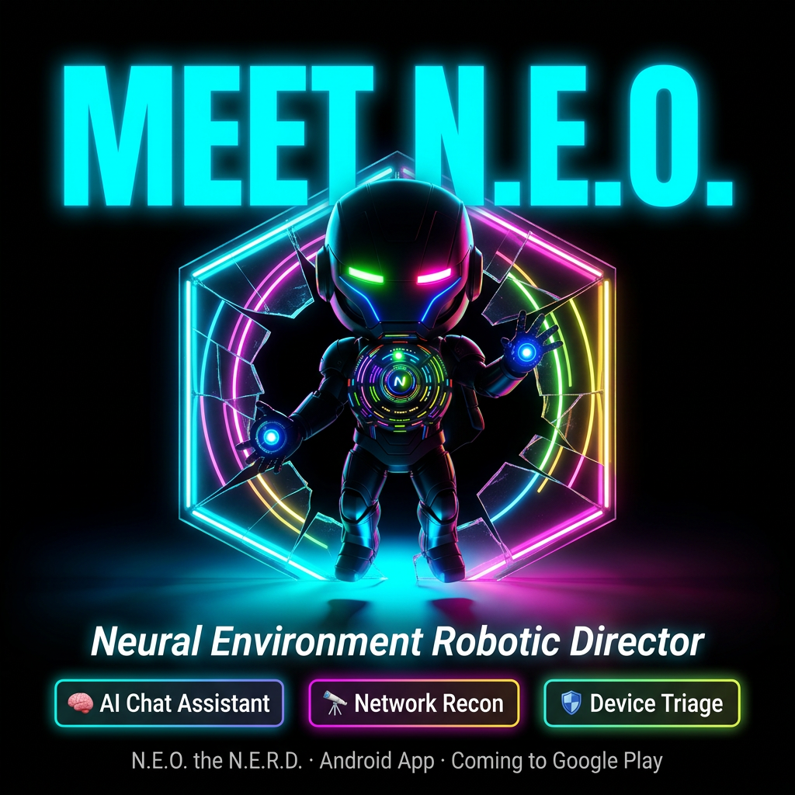
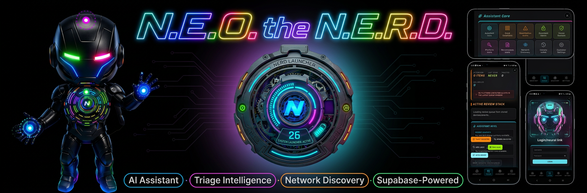
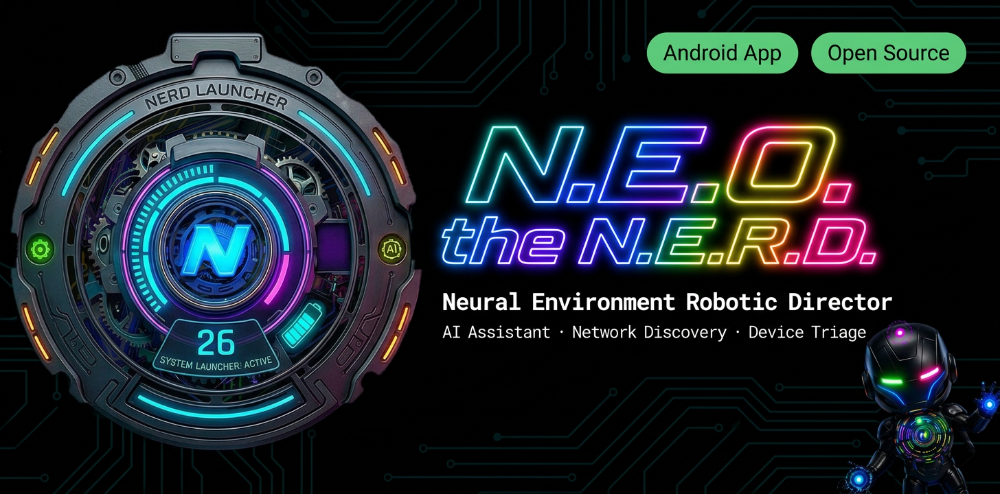
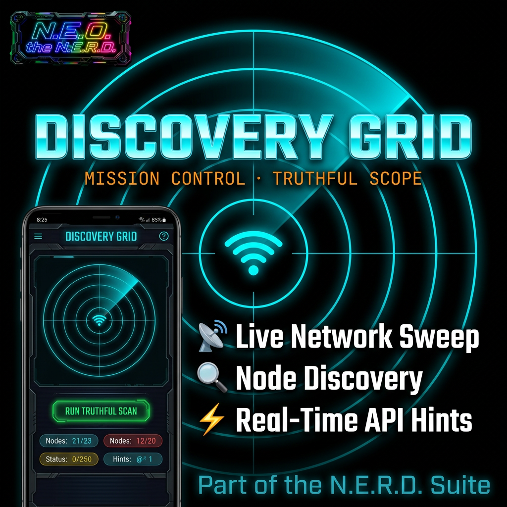
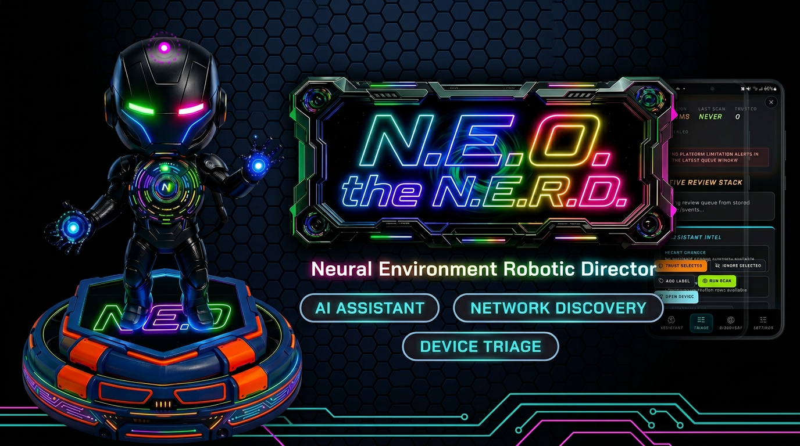

<div align="center">
  
</div>

# N.E.O. — Neural Environment Operator

N.E.O. is a sci-fi styled assistant interface built with React + Vite, backed by Supabase for authentication/data and an Express server that proxies protected Gemini AI routes.

<div align="center">
  
</div>

## Features

- **Secure Google sign-in with Supabase Auth**
  - Browser and Capacitor-native sign-in support.
  - Session-aware protected API calls with automatic token refresh handling.
- **Protected AI routes (`/api/ai/*`)**
  - Server-side JWT validation against Supabase (fail-closed behavior).
  - Request validation, size limits, and rate limiting on AI endpoints.
- **Task management + message history**
  - User-scoped task and message persistence via Supabase Postgres.
  - RLS-oriented architecture for user-owned records.
- **Capacitor Android shell**
  - Web app can run as a native Android host using the included Capacitor project.
- **HUD-style interface (frozen layout)**
  - Live center component is `Robot2D`.
  - Core frame/HUD composition is intentionally preserved.

<div align="center">
  
</div>


## Tech Stack

- **Frontend:** React 19, TypeScript, Vite 6
- **Backend server:** Express 4 + `tsx` runtime
- **Auth + DB:** Supabase (`@supabase/supabase-js`)
- **AI:** Google Gemini (`@google/genai`)
- **Native shell:** Capacitor 8 (Android)

## Repository Highlights

- `server.ts` — Express app, Supabase JWT verification, protected AI routes.
- `src/authClient.ts` — Auth/session management, protected fetch helpers, mobile OAuth handling.
- `src/lib/supabase.ts` — Browser Supabase client configuration.
- `src/context/NeuralContext.tsx` — Runtime/auth wiring for the app shell.
- `src/components/TaskLog.tsx` / `src/components/ChatInterface.tsx` — Task + chat user interfaces.
- `android/` — Capacitor Android project.

<div align="center">
  
</div>


## Prerequisites

- **Node.js** 20+ recommended
- **npm** 10+ recommended
- A Supabase project with:
  - Google OAuth provider configured
  - Required tables/policies for tasks and messages
- A Gemini API key

## Environment Configuration

1. Copy environment template:

   ```bash
   cp .env.example .env
   ```

2. Populate required variables in `.env`:

   - `VITE_SUPABASE_URL`
   - `VITE_SUPABASE_ANON_KEY`
   - `SUPABASE_SERVICE_ROLE_KEY`
   - `GEMINI_API_KEY`
   - `APP_URL`

> Keep `SUPABASE_SERVICE_ROLE_KEY` server-only. Do not expose it in frontend code.

## Local Development

Install dependencies and start the app/server:

```bash
npm ci
npm run dev
```

Default behavior:
- Vite middleware is hosted through the Express process (`server.ts`).
- Protected API routes are served from the same server runtime.

## Quality Gates

Run these checks before opening a PR:

```bash
npm run lint
npm run build
```

## Expected Runtime Verification

After setup, verify the following manually:

1. **Sign-in works**
   - Login with Google and return to authenticated app state.
2. **Tasks CRUD works**
   - Create, read, update, and delete task records.
3. **Messages/history works**
   - Send messages and confirm history persists for the signed-in user.
4. **Protected AI routes work while signed in**
   - AI requests succeed with valid session token.
   - Requests fail with `401` when token is missing/invalid.

## Build Artifacts

Create a production web build:

```bash
npm run build
```

Preview the built output locally:

```bash
npm run preview
```

## Security Notes

- Server verifies Supabase bearer tokens before protected AI processing.
- AI routes apply body-size controls and model/config validation guards.
- Rate limiting is enabled on API endpoints to reduce abuse risk.

## Troubleshooting

- **`Unauthorized: Missing or invalid token`**
  - Ensure user is signed in and requests include bearer token from `fetchProtectedJson`.
- **Supabase auth verification misconfiguration**
  - Check `VITE_SUPABASE_URL` and `SUPABASE_SERVICE_ROLE_KEY` in `.env`.
- **Gemini request failures**
  - Validate `GEMINI_API_KEY` and confirm selected model is allowed by server validation.

## Project Status Guidance

- Supabase is the active backend runtime.
- `Robot2D` is the active center robot component.
- `Robot3D` is intentionally parked and should remain disabled unless explicitly requested.

---
<div align="center">
  
</div>


If you are onboarding to this repo, start with **Environment Configuration**, then run **Local Development**, and validate the **Expected Runtime Verification** flow end-to-end.
